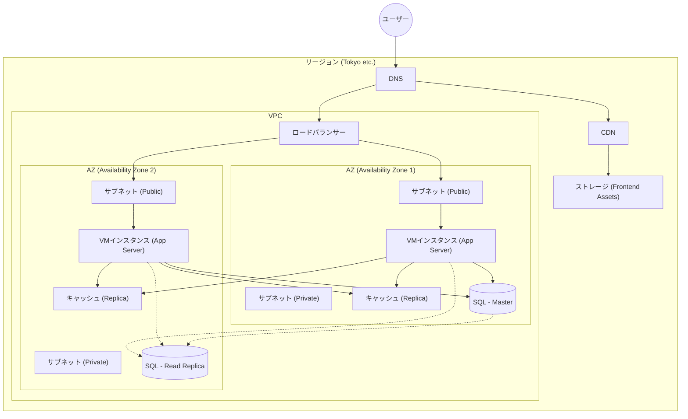

```mermaid
graph TD
    User((ユーザー))
    
    subgraph Region ["リージョン (Tokyo etc.)"]
        DNS[DNS]
        CDN[CDN]
        
        subgraph VPC [VPC]
            LB[ロードバランサー]
            
            subgraph AZ1 ["AZ (Availability Zone 1)"]
                SubnetPub1["サブネット (Public)"]
                SubnetPriv1["サブネット (Private)"]
                VM1["VMインスタンス (App Server)"]
                Cache1["キャッシュ (Replica)"]
                SQL_M[("SQL - Master")]
            end
            
            subgraph AZ2 ["AZ (Availability Zone 2)"]
                SubnetPub2["サブネット (Public)"]
                SubnetPriv2["サブネット (Private)"]
                VM2["VMインスタンス (App Server)"]
                Cache2["キャッシュ (Replica)"]
                SQL_S[("SQL - Read Replica")]
            end
        end
        
        ObjStorage["ストレージ (Frontend Assets)"]
    end

    %% Access Flows
    User --> DNS
    DNS --> CDN
    DNS --> LB
    
    %% Static Content
    CDN --> ObjStorage
    
    %% Application Flow
    LB --> SubnetPub1 & SubnetPub2
    SubnetPub1 --> VM1
    SubnetPub2 --> VM2
    
    %% Data Access (Read Heavy Optimization)
    VM1 & VM2 --> Cache1 & Cache2
    
    %% DB Write Flow
    VM1 & VM2 --> SQL_M
    
    %% DB Read Flow (Cache Miss)
    VM1 & VM2 -.-> SQL_S
    
    %% Replication
    SQL_M -.-> SQL_S
```
