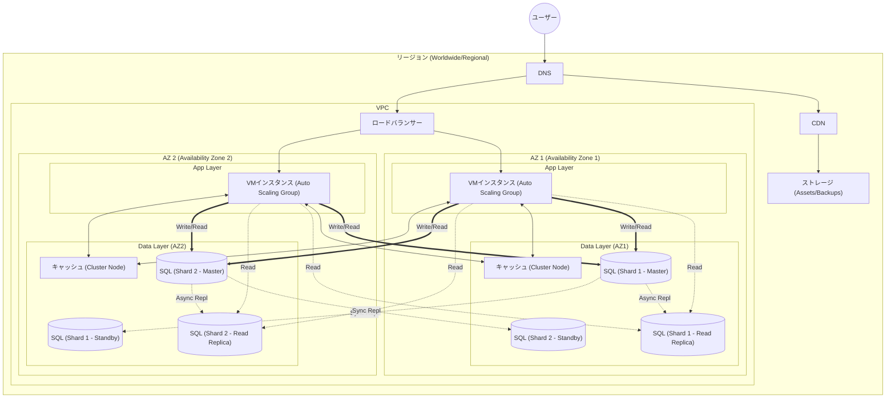

```mermaid
graph TD
    User((ユーザー))
    
    subgraph Region ["リージョン (Worldwide/Regional)"]
        DNS[DNS]
        CDN[CDN]
        
        subgraph VPC [VPC]
            LB[ロードバランサー]
            
            subgraph AZ1 ["AZ 1 (Availability Zone 1)"]
                subgraph AppLayer1 ["App Layer"]
                    VM1["VMインスタンス (Auto Scaling Group)"]
                end
                
                subgraph DataLayer1 ["Data Layer (AZ1)"]
                    Cache1["キャッシュ (Cluster Node)"]
                    
                    %% Shard 1 Primary / Shard 2 Standby
                    SQL_S1_Pri[("SQL (Shard 1 - Master)")]
                    SQL_S2_Sec[("SQL (Shard 2 - Standby)")]
                    
                    %% Read Replicas
                    SQL_S1_Read1[("SQL (Shard 1 - Read Replica)")]
                end
            end
            
            subgraph AZ2 ["AZ 2 (Availability Zone 2)"]
                subgraph AppLayer2 ["App Layer"]
                    VM2["VMインスタンス (Auto Scaling Group)"]
                end
                
                subgraph DataLayer2 ["Data Layer (AZ2)"]
                    Cache2["キャッシュ (Cluster Node)"]
                    
                    %% Shard 2 Primary / Shard 1 Standby
                    SQL_S2_Pri[("SQL (Shard 2 - Master)")]
                    SQL_S1_Sec[("SQL (Shard 1 - Standby)")]
                    
                    %% Read Replicas
                    SQL_S2_Read1[("SQL (Shard 2 - Read Replica)")]
                end
            end
        end
        
        ObjStorage["ストレージ (Assets/Backups)"]
    end

    %% Routing
    User --> DNS
    DNS --> CDN
    DNS --> LB
    CDN --> ObjStorage
    
    %% Load Balancing to App
    LB --> VM1 & VM2
    
    %% Caching (Distributed)
    VM1 & VM2 <--> Cache1 & Cache2
    
    %% Database Access (Sharding Logic in App)
    %% Write / Read Master (Split by User ID)
    VM1 & VM2 == Write/Read ==> SQL_S1_Pri
    VM1 & VM2 == Write/Read ==> SQL_S2_Pri
    
    %% Replication (High Availability)
    SQL_S1_Pri -. Sync Repl .-> SQL_S1_Sec
    SQL_S2_Pri -. Sync Repl .-> SQL_S2_Sec
    
    %% Replication (Read Scaling)
    SQL_S1_Pri -. Async Repl .-> SQL_S1_Read1
    SQL_S2_Pri -. Async Repl .-> SQL_S2_Read1
    
    %% Read Replica Access (Optional for Analytics/Heavy Read)
    VM1 & VM2 -. Read .-> SQL_S1_Read1 & SQL_S2_Read1
```