# Integrated Fire Management System (FMS) - Architecture Design Document

## System Overview

The Integrated Fire Management System (FMS) is a comprehensive platform that digitalizes the entire fire service ecosystem, managing everything from emergency dispatch to post-incident analysis in a unified framework.

---

## Overall System Architecture

```mermaid
graph TB
    subgraph Users["👥 User Layer"]
        U1[Fire Chiefs]
        U2[Firefighters]
        U3[Dispatchers]
        U4[Inspectors]
        U5[Citizens]
    end

    subgraph Presentation["🖥️ Presentation Layer"]
        WEB[Web Application<br/>React.js/Next.js]
        MOBILE[Mobile Apps<br/>Flutter/React Native]
        DESKTOP[Desktop<br/>PWA]
    end

    subgraph Security["🔐 API Gateway & Security Layer"]
        AUTH[Authentication & Authorization<br/>Keycloak SSO]
        ENCRYPT[Encrypted Communication<br/>TLS 1.3 / AES-256]
        GATEWAY[API Gateway<br/>Load Balancing & Routing]
        AUDIT[Audit Logs]
    end

    subgraph Application["⚙️ Application Layer - Core Modules"]
        M1[🚨 Emergency Dispatch]
        M2[🗺️ Incident Command]
        M3[🚒 Asset Management]
        M4[👥 Personnel & Safety]
        M5[🔥 Fire Prevention]
        M6[📊 Analytics & Intelligence]
    end

    subgraph Logic["🧮 Business Logic Layer"]
        WF[Workflow Engine<br/>Camunda/Temporal]
        NOTIF[Notifications & Alerts<br/>Message Queue]
        RULES[Rules Engine<br/>Business Rules]
    end

    subgraph Data["🗄️ Data Layer"]
        DB[(PostgreSQL<br/>+ PostGIS)]
        CACHE[(Redis<br/>Cache)]
        STORAGE[File Storage<br/>S3/MinIO]
        DW[(Data Warehouse<br/>Analytics DB)]
    end

    subgraph Integration["🔌 Integration Layer"]
        GIS[GIS Systems]
        IOT[IoT Sensors]
        POLICE[Police Systems]
        EMS[Emergency Medical Services]
        WEATHER[Weather APIs]
    end

    subgraph Infrastructure["☁️ Infrastructure Layer"]
        CLOUD[Cloud Platform<br/>99.99% SLA]
        K8S[Kubernetes<br/>Container Orchestration]
        MONITOR[Monitoring & Logging<br/>Alert Management]
    end

    Users --> Presentation
    Presentation --> Security
    Security --> Application
    Application --> Logic
    Logic --> Data
    Application <--> Integration
    Data --> Infrastructure
    Logic --> Infrastructure
```

---

## Detailed Module Architecture

```mermaid
graph LR
    subgraph Core["Core Modules (Required)"]
        DISPATCH[Emergency Dispatch<br/>━━━━━━━━<br/>• 112/911 Integration<br/>• GPS Location<br/>• Auto Dispatch<br/>• Real-time Tracking]
        INCIDENT[Incident Command<br/>━━━━━━━━<br/>• GIS Visualization<br/>• Unit Deployment<br/>• Hydrant Mapping<br/>• Multi-agency Coordination]
    end

    subgraph Optional["Optional Modules (Selectable)"]
        ASSET[Asset & Fleet Management<br/>━━━━━━━━<br/>• Vehicle Tracking<br/>• Inventory Management<br/>• Maintenance Scheduling<br/>• Fuel Monitoring]
        
        PERSONNEL[Personnel & Safety<br/>━━━━━━━━<br/>• Shift Management<br/>• Certification Tracking<br/>• Health Monitoring<br/>• Accountability System]
        
        PREVENTION[Fire Prevention<br/>━━━━━━━━<br/>• Inspection Scheduling<br/>• Digital Checklists<br/>• Violation Tracking<br/>• Education Records]
        
        ANALYTICS[Analytics & AI<br/>━━━━━━━━<br/>• KPI Dashboards<br/>• Heat Maps<br/>• Trend Analysis<br/>• Predictive AI Models]
    end

    DISPATCH --> INCIDENT
    INCIDENT --> ASSET
    INCIDENT --> PERSONNEL
    INCIDENT --> PREVENTION
    INCIDENT --> ANALYTICS
```

---

## Data Flow Diagram

---

## Technology Stack Details

### Frontend Layer

| Category | Technology | Purpose |
|---------|------|---------|
| **Web Application** | React.js / Next.js | Command center dashboards, admin console |
| **Mobile Apps** | Flutter / React Native | Field personnel app, inspection checklists |
| **Mapping** | Leaflet / OpenStreetMap | GIS mapping, route visualization |
| **UI Components** | Tailwind CSS / Material UI | Responsive design framework |

### Backend Layer

| Category | Technology | Purpose |
|---------|------|---------|
| **Application Server** | Node.js (NestJS) / Java (Spring Boot) | Mission-critical business logic |
| **Workflow Engine** | Camunda / Temporal | Complex dispatch workflow automation |
| **API Layer** | RESTful API / GraphQL | Client communication |
| **Real-time Communication** | WebSocket / Server-Sent Events | Instant data updates |

### Data Layer

| Category | Technology | Purpose |
|---------|------|---------|
| **Primary Database** | PostgreSQL + PostGIS | Structured data, geospatial information |
| **Cache** | Redis | Real-time tracking, session management |
| **File Storage** | S3 / MinIO | Photos, videos, document management |
| **Analytics DB** | Data Warehouse (Snowflake/BigQuery) | BI & reporting |

### Integration & Connectivity

| Category | Technology | Purpose |
|---------|------|---------|
| **GIS Systems** | ArcGIS API / OpenStreetMap | Geographic information integration |
| **IoT Communication** | MQTT / LoRaWAN | Sensor data collection |
| **Messaging** | RabbitMQ / Apache Kafka | Asynchronous processing, event-driven |
| **API Management** | Kong / Apigee | API gateway, rate limiting |

### Security

| Category | Technology | Purpose |
|---------|------|---------|
| **Authentication & Authorization** | Keycloak (SSO) / OAuth 2.0 | Single sign-on |
| **Encryption** | TLS 1.3 / AES-256 | Communication & data encryption |
| **Audit Logging** | ELK Stack (Elasticsearch) | Complete operation tracking |
| **Vulnerability Assessment** | OWASP ZAP / Snyk | Security testing |

### Infrastructure

| Category | Technology | Purpose |
|---------|------|---------|
| **Containers** | Docker / Kubernetes | Microservices management |
| **CI/CD** | GitLab CI / Jenkins | Automated deployment |
| **Monitoring** | Prometheus / Grafana | Performance monitoring |
| **Log Management** | Fluentd / Loki | Log aggregation & analysis |

---

## System Deployment Architecture

---

## High Availability (HA) Architecture

---

## Security Architecture

---

## Microservices Architecture

---

## Key Process Flows

### 1. Emergency Call to Dispatch Flow

### 2. On-Scene Operations Flow

---

## Module Dependency Map

---

## Implementation Roadmap

---

## White-Label & Multi-Tenancy Architecture

---

## IoT Integration Architecture

---

## Mobile Application Architecture

---

## Analytics & Business Intelligence Architecture

---

## Disaster Recovery & Business Continuity

---

## Key System Features

### ✅ Modular Design
- Subscribe only to required modules
- Phased implementation to minimize risk and cost
- Easy future expansion

### ✅ White-Label Support
- Full branding customization per fire department
- Custom domains (e.g., fms.cityfire.gov)
- Logo, color scheme, and organization name customization

### ✅ Multi-Tenancy
- Single infrastructure supporting multiple organizations
- Complete data isolation between organizations
- Reduced operational costs

### ✅ API-First Design
- All features accessible via API
- Easy integration with police, EMS, and other agencies
- IoT sensor and device integration

### ✅ Offline Capability
- Essential functions continue during network outages
- Local data storage in mobile apps
- Automatic synchronization upon connection recovery

### ✅ High Availability
- 99.99% SLA (less than 53 minutes downtime per year)
- Multi-region deployment for disaster recovery
- Automatic failover functionality

---

## Expected Impact & Benefits

| Impact Area | Specific Improvement |
|------------|---------------------|
| **Response Time** | 30% reduction through automated dispatch recommendations |
| **Lives Saved** | Increased survival rates through faster response |
| **Operational Cost** | 20-30% reduction through resource optimization |
| **Firefighter Safety** | Enhanced safety via real-time location tracking |
| **Data-Driven Decisions** | Evidence-based policy making and budget allocation |
| **Public Trust** | Improved trust through transparent record-keeping |

---

## Performance Metrics & KPIs

