# 統合火災管理システム (FMS) - アーキテクチャ設計書

## システム概要

統合火災管理システム(Fire Management System: FMS)は、消防サービス全体をデジタル化し、緊急通報から事後分析までを一元管理する包括的なプラットフォームです。

---

## 全体アーキテクチャ図

```mermaid
graph TB
    subgraph Users["👥 ユーザー層"]
        U1[消防指揮官]
        U2[消防隊員]
        U3[通信指令員]
        U4[査察員]
        U5[一般市民]
    end

    subgraph Presentation["🖥️ プレゼンテーション層"]
        WEB[Webアプリ<br/>React.js/Next.js]
        MOBILE[モバイルアプリ<br/>Flutter/React Native]
        DESKTOP[デスクトップ<br/>PWA]
    end

    subgraph Security["🔐 APIゲートウェイ & セキュリティ層"]
        AUTH[認証・認可<br/>Keycloak SSO]
        ENCRYPT[暗号化通信<br/>TLS 1.3 / AES-256]
        GATEWAY[APIゲートウェイ<br/>負荷分散・ルーティング]
        AUDIT[監査ログ]
    end

    subgraph Application["⚙️ アプリケーション層 - コアモジュール"]
        M1[🚨 緊急通報・出動管理]
        M2[🗺️ 現場指揮管理]
        M3[🚒 資産・車両管理]
        M4[👥 人員・安全管理]
        M5[🔥 火災予防・査察]
        M6[📊 分析・インテリジェンス]
    end

    subgraph Logic["🧮 ビジネスロジック層"]
        WF[ワークフローエンジン<br/>Camunda/Temporal]
        NOTIF[通知・アラート<br/>Message Queue]
        RULES[ルールエンジン<br/>Business Rules]
    end

    subgraph Data["🗄️ データ層"]
        DB[(PostgreSQL<br/>+ PostGIS)]
        CACHE[(Redis<br/>キャッシュ)]
        STORAGE[ファイルストレージ<br/>S3/MinIO]
        DW[(Data Warehouse<br/>分析DB)]
    end

    subgraph Integration["🔌 統合・連携層"]
        GIS[GISシステム]
        IOT[IoTセンサー]
        POLICE[警察システム]
        EMS[医療サービス]
        WEATHER[気象情報]
    end

    subgraph Infrastructure["☁️ インフラストラクチャ層"]
        CLOUD[クラウド基盤<br/>99.99% SLA]
        K8S[Kubernetes<br/>コンテナ管理]
        MONITOR[監視・ログ<br/>アラート管理]
    end

    Users --> Presentation
    Presentation --> Security
    Security --> Application
    Application --> Logic
    Logic --> Data
    Application <--> Integration
    Data --> Infrastructure
    Logic --> Infrastructure
```

---

## 詳細モジュール構成図

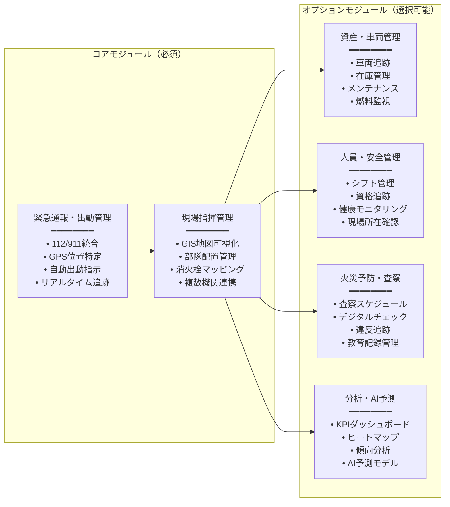

---

## データフロー図

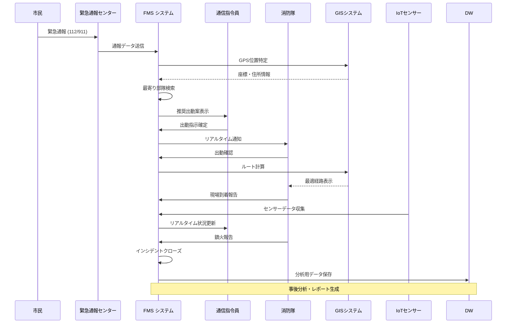

---

## 技術スタック詳細

### フロントエンド層

| カテゴリ | 技術 | 用途 |
|---------|------|------|
| **Webアプリ** | React.js / Next.js | 指令センターダッシュボード、管理コンソール |
| **モバイルアプリ** | Flutter / React Native | 現場隊員用アプリ、査察チェックリスト |
| **地図表示** | Leaflet / OpenStreetMap | GISマッピング、ルート表示 |
| **UI コンポーネント** | Tailwind CSS / Material UI | レスポンシブデザイン |

### バックエンド層

| カテゴリ | 技術 | 用途 |
|---------|------|------|
| **アプリケーションサーバー** | Node.js (NestJS) / Java (Spring Boot) | ミッションクリティカルなビジネスロジック |
| **ワークフローエンジン** | Camunda / Temporal | 複雑な出動フロー自動化 |
| **API層** | RESTful API / GraphQL | クライアントとの通信 |
| **リアルタイム通信** | WebSocket / Server-Sent Events | 即座のデータ更新 |

### データ層

| カテゴリ | 技術 | 用途 |
|---------|------|------|
| **メインデータベース** | PostgreSQL + PostGIS | 構造化データ、地理空間情報 |
| **キャッシュ** | Redis | リアルタイム追跡、セッション管理 |
| **ファイルストレージ** | S3 / MinIO | 写真、動画、文書管理 |
| **分析DB** | Data Warehouse (Snowflake/BigQuery) | BI・レポーティング |

### 統合・連携

| カテゴリ | 技術 | 用途 |
|---------|------|------|
| **GISシステム** | ArcGIS API / OpenStreetMap | 地理情報統合 |
| **IoT通信** | MQTT / LoRaWAN | センサーデータ収集 |
| **メッセージング** | RabbitMQ / Apache Kafka | 非同期処理、イベント駆動 |
| **API管理** | Kong / Apigee | APIゲートウェイ、レート制限 |

### セキュリティ

| カテゴリ | 技術 | 用途 |
|---------|------|------|
| **認証・認可** | Keycloak (SSO) / OAuth 2.0 | シングルサインオン |
| **暗号化** | TLS 1.3 / AES-256 | 通信・データ暗号化 |
| **監査ログ** | ELK Stack (Elasticsearch) | 全操作記録・追跡 |
| **脆弱性診断** | OWASP ZAP / Snyk | セキュリティテスト |

### インフラストラクチャ

| カテゴリ | 技術 | 用途 |
|---------|------|------|
| **コンテナ** | Docker / Kubernetes | マイクロサービス管理 |
| **CI/CD** | GitLab CI / Jenkins | 自動デプロイメント |
| **監視** | Prometheus / Grafana | パフォーマンス監視 |
| **ログ管理** | Fluentd / Loki | ログ集約・分析 |

---

## システム配置図

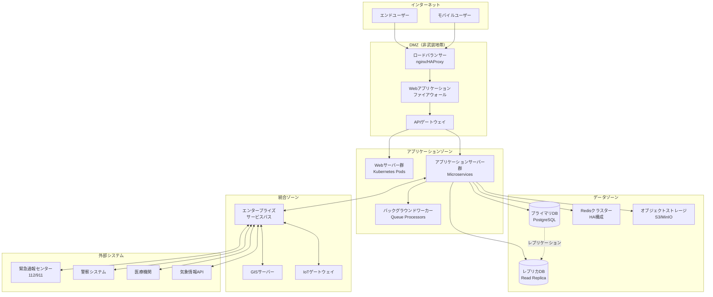

---

## 高可用性(HA)構成図

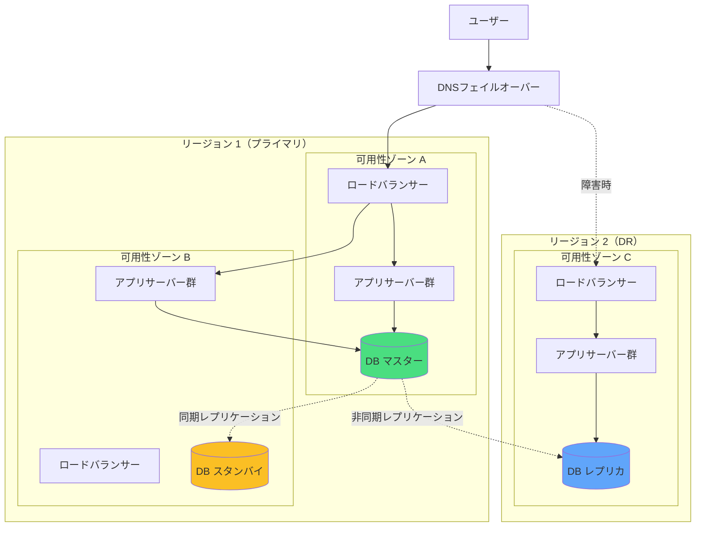

---

## セキュリティアーキテクチャ

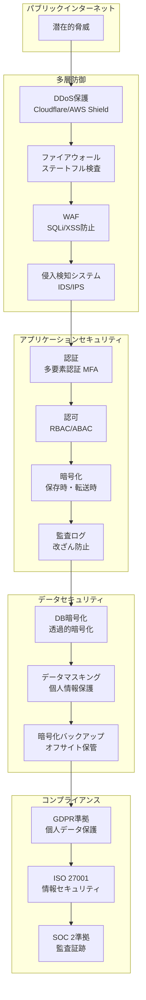

---

## マイクロサービスアーキテクチャ

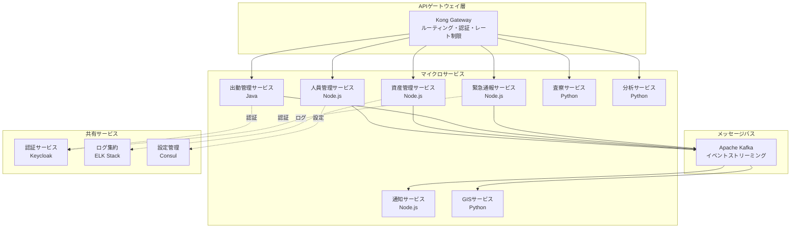

---

## 主要機能フロー

### 1. 緊急通報から出動まで

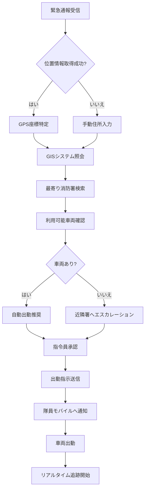

### 2. 現場活動フロー

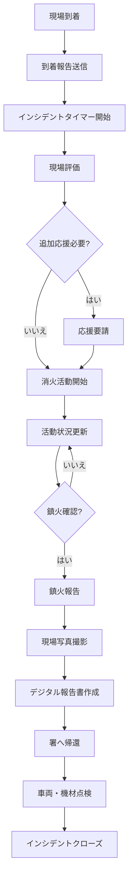

---

## モジュール間依存関係

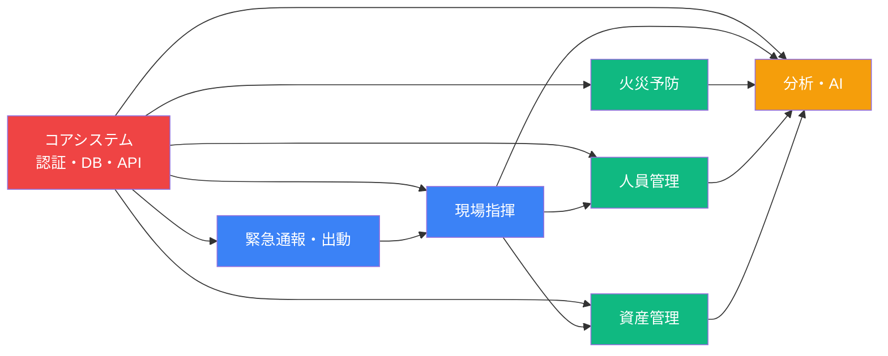

---

## 導入フェーズ計画

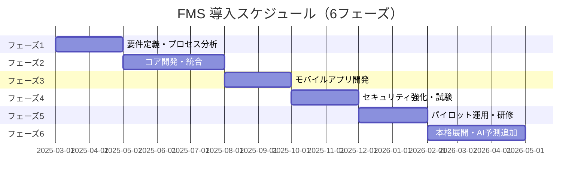

---

## システムの主要特徴

### ✅ モジュール式設計
- 必要な機能のみを選択して購入可能
- 段階的な導入でリスクとコストを最小化
- 将来的な機能拡張が容易

### ✅ ホワイトラベル対応
- 各消防機関のブランディングに完全対応
- 独自ドメイン（例: fms.tokyo-fire.jp）での運用
- ロゴ、配色、組織名のカスタマイズ

### ✅ マルチテナント
- 単一インフラで複数組織を安全に分離
- 組織間のデータ完全隔離
- 運用コストの削減

### ✅ API優先設計
- すべての機能がAPI経由でアクセス可能
- 警察、医療など他機関システムとの連携が容易
- IoTセンサー・デバイス統合

### ✅ オフライン機能
- 災害時の通信途絶でも基本機能が継続
- モバイルアプリでのローカルデータ保存
- 接続回復時の自動同期

### ✅ 高可用性
- 99.99% SLA（年間53分以下のダウンタイム）
- マルチリージョン展開による災害対策
- 自動フェイルオーバー機能

---

## 期待される効果

| 効果領域 | 具体的な改善 |
|---------|------------|
| **応答時間短縮** | 自動出動推奨により平均30%削減 |
| **人命救助** | 迅速な対応により救命率向上 |
| **運用コスト** | 資源最適化により20-30%削減 |
| **隊員安全** | リアルタイム位置追跡で安全性向上 |
| **データ駆動** | 証拠に基づく政策立案・予算配分 |
| **市民信頼** | 透明性の高い記録管理で信頼性向上 |

---

## まとめ

統合火災管理システム(FMS)は、消防サービスのデジタルトランスフォーメーションを実現する戦略的基盤です。モジュール式のアーキテクチャにより、小規模な消防署から国家レベルまで、あらゆる規模の組織に対応可能な柔軟性を持ちます。

セキュリティ・バイ・デザインの原則に基づき、高可用性とスケーラビリティを兼ね備えた本システムは、アフリカをはじめとする新興市場における**公共安全のフラッグシップソリューション**となることが期待されます。
