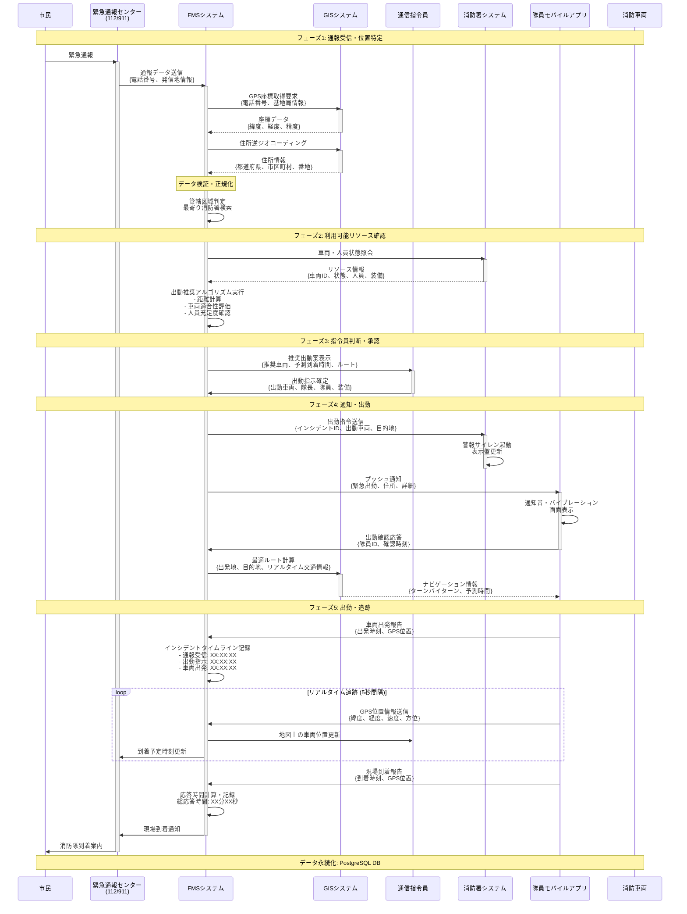
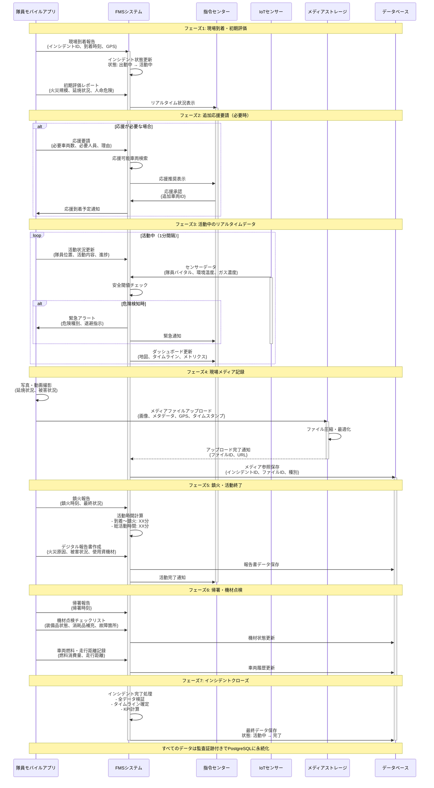
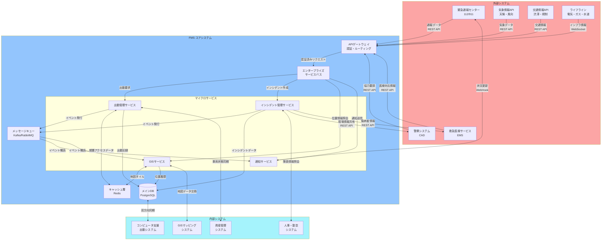
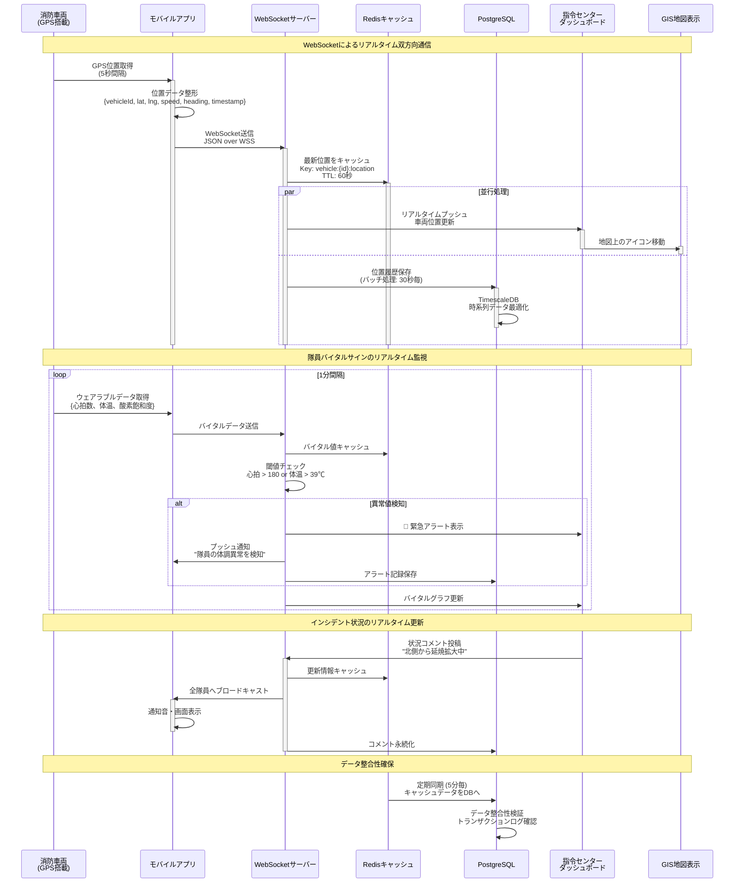
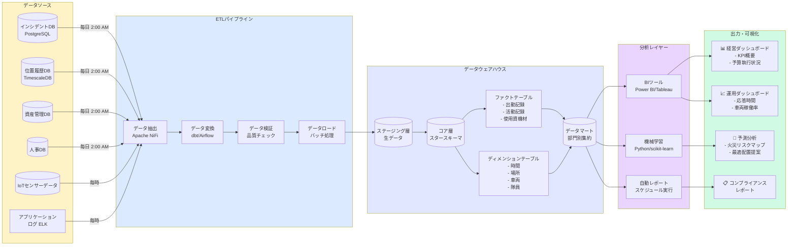
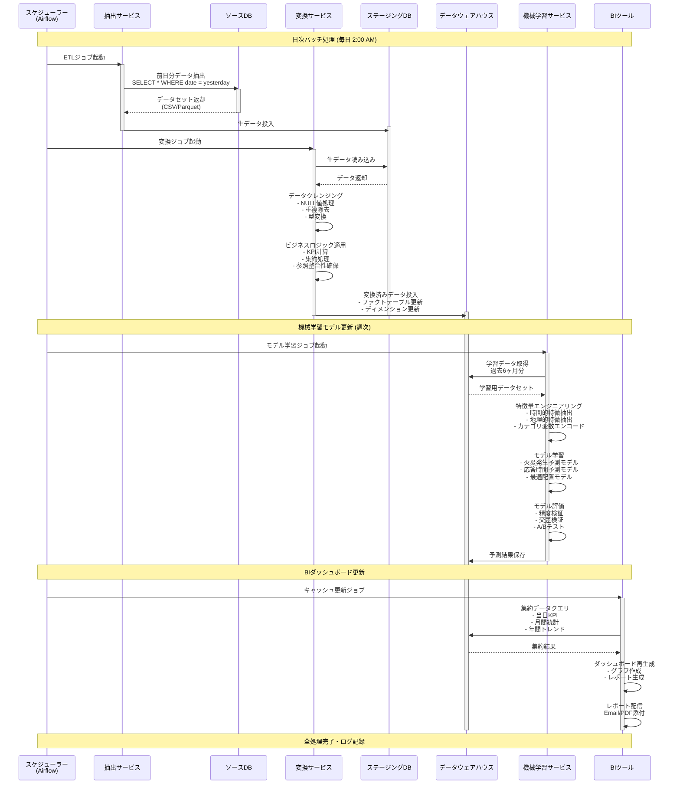
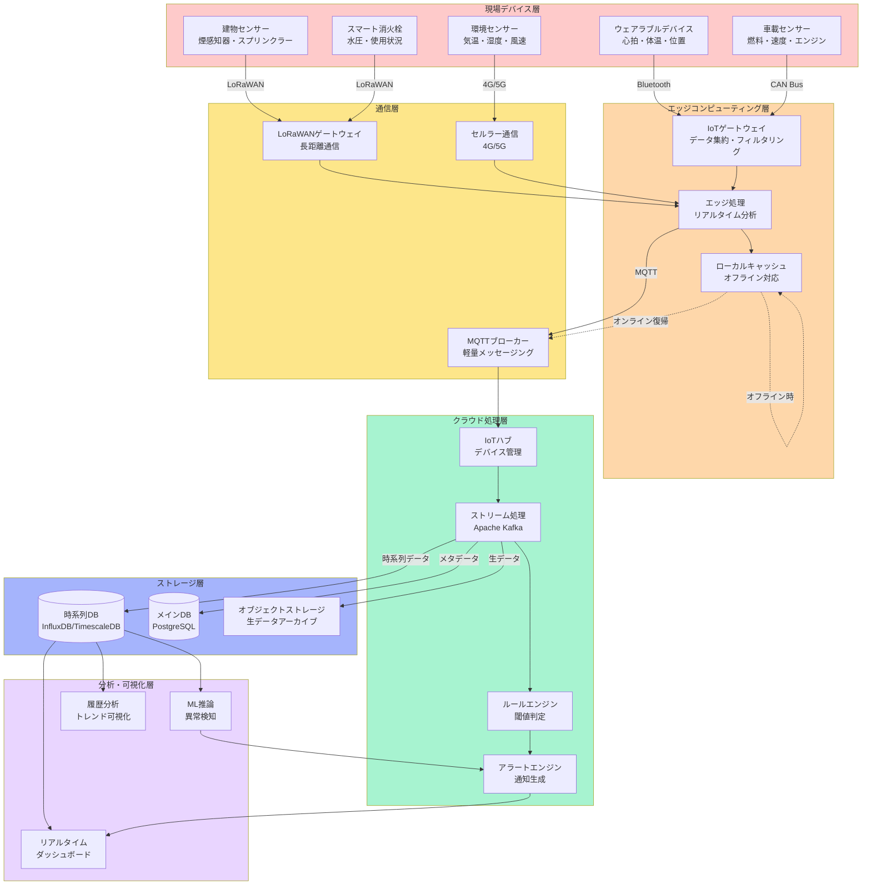
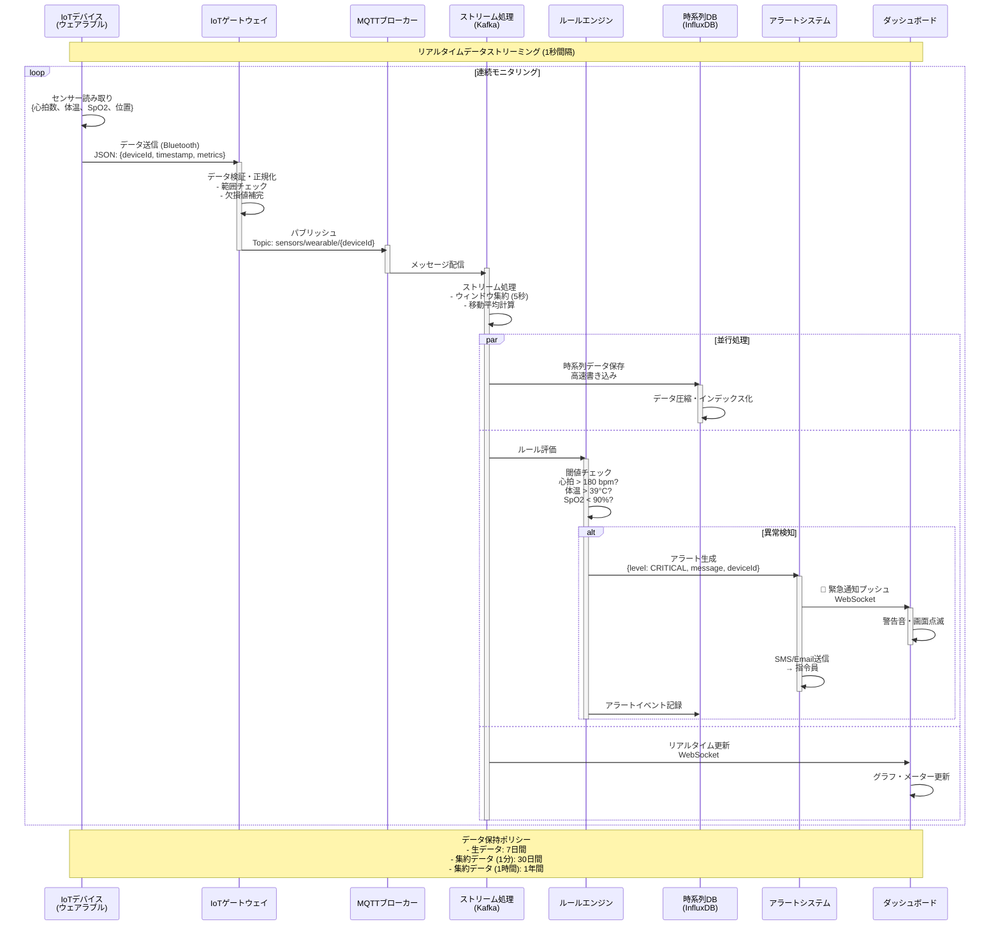
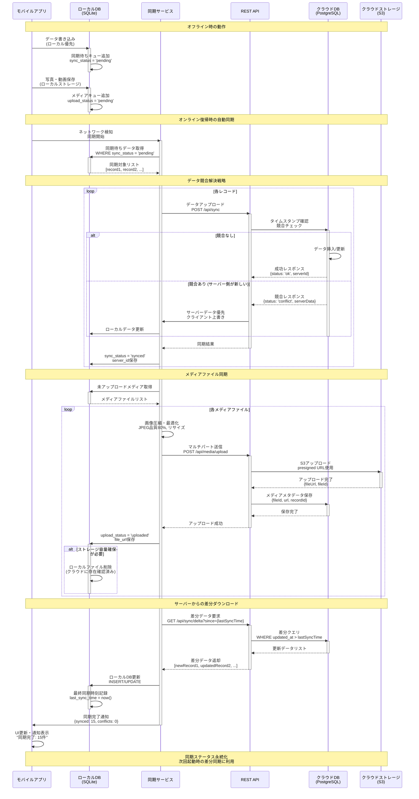

# 統合火災管理システム (FMS) - データフロー図集

## 目次
1. [緊急通報から出動までの全体フロー](#1-緊急通報から出動までの全体フロー)
2. [現場活動データフロー](#2-現場活動データフロー)
3. [システム間データ連携フロー](#3-システム間データ連携フロー)
4. [リアルタイムデータフロー](#4-リアルタイムデータフロー)
5. [分析・レポーティングデータフロー](#5-分析レポーティングデータフロー)
6. [査察・予防データフロー](#6-査察予防データフロー)
7. [IoTセンサーデータフロー](#7-iotセンサーデータフロー)
8. [モバイルアプリデータ同期フロー](#8-モバイルアプリデータ同期フロー)

---

## 1. 緊急通報から出動までの全体フロー



---

## 2. 現場活動データフロー



---

## 3. システム間データ連携フロー



---

## 4. リアルタイムデータフロー



---

## 5. 分析・レポーティングデータフロー



### 分析データフロー詳細シーケンス



---

## 6. 査察・予防データフロー

```mermaid
sequenceDiagram
    participant Inspector as 査察員<br/>モバイルアプリ
    participant FMS as FMSシステム
    participant Building as 建物DB
    participant GIS as GISシステム
    participant Violation as 違反追跡システム
    participant Notification as 通知サービス
    participant Owner as 建物所有者

    Note over Inspector,Owner: フェーズ1: 査察計画・スケジューリング

    FMS->>Building: リスクベース査察対象抽出<br/>- 前回査察日<br/>- 建物用途<br/>- 違反履歴
    activate Building
    Building-->>FMS: 対象建物リスト
    deactivate Building

    FMS->>GIS: 地理的クラスタリング<br/>効率的ルート生成
    activate GIS
    GIS-->>FMS: 最適査察ルート
    deactivate GIS

    FMS->>Inspector: 査察スケジュール配信<br/>{日付、建物リスト、ルート}
    activate Inspector

    Note over Inspector,Owner: フェーズ2: 現地査察実施

    Inspector->>FMS: 査察開始報告<br/>{建物ID、開始時刻、GPS位置}
    activate FMS

    FMS->>Inspector: デジタルチェックリスト送信<br/>{建物種別に応じた項目}
    
    loop 各チェック項目
        Inspector->>Inspector: 現地確認・評価<br/>- 消火設備<br/>- 避難経路<br/>- 防火区画
        
        alt 不備・違反発見
            Inspector->>Inspector: 写真撮影<br/>位置情報付き
            Inspector->>FMS: 違反事項報告<br/>{項目、重大度、写真、位置}
            FMS->>Violation: 違反記録作成<br/>{建物ID、違反内容、期限}
            activate Violation
        end
    end

    Inspector->>FMS: 査察完了報告<br/>{総合評価、所見、次回査察推奨日}
    
    Note over Inspector,Owner: フェーズ3: 違反是正通知

    alt 違反が存在する場合
        FMS->>Building: 建物所有者情報取得
        Building-->>FMS: 所有者連絡先
        
        FMS->>Notification: 是正通知書生成<br/>{違反内容、是正期限、罰則}
        activate Notification
        
        Notification->>Owner: 通知送信<br/>Email + 書面郵送
        activate Owner
        
        Notification->>Violation: 通知送信記録
        deactivate Notification
    end

    Note over Inspector,Owner: フェーズ4: 是正確認・フォローアップ

    Owner->>FMS: 是正完了報告<br/>(任意: Webポータル経由)
    deactivate Owner
    
    FMS->>Inspector: 再査察スケジュール自動生成<br/>{是正期限の7日前}
    
    Inspector->>FMS: 再査察実施<br/>是正状況確認
    
    alt 是正完了確認
        Inspector->>Violation: 違反クローズ<br/>{是正確認日、写真}
        Violation->>Building: 建物評価更新<br/>リスクスコア改善
        deactivate Violation
    else 是正未完了
        Inspector->>Violation: 違反エスカレーション<br/>法的措置フラグ
        FMS->>Notification: 警告通知送信
    end

    FMS->>Building: 査察履歴更新<br/>{査察日、結果、次回予定日}
    deactivate Building

    Inspector->>FMS: 査察データ同期完了
    deactivate Inspector
    deactivate FMS

    Note over Inspector,Owner: 全データはPostgreSQLに永続化・監査証跡保持
```

---

## 7. IoTセンサーデータフロー



### IoTデータ処理詳細シーケンス



---

## 8. モバイルアプリデータ同期フロー



---

## データフロー サマリー

### 主要データパス

| データ種別 | 発生源 | 処理方法 | 保存先 | リアルタイム性 |
|----------|--------|---------|--------|--------------|
| **緊急通報データ** | 112/911センター | REST API → 出動管理サービス | PostgreSQL | < 1秒 |
| **GPS位置情報** | 消防車両 | WebSocket → Redis → DB | Redis + PostgreSQL | 5秒間隔 |
| **バイタルサイン** | ウェアラブル | MQTT → Kafka → 時系列DB | InfluxDB | 1秒間隔 |
| **現場写真・動画** | モバイルアプリ | マルチパート → S3 | S3 + メタデータDB | 非同期 |
| **査察チェックリスト** | 査察員アプリ | オフライン → 同期 | SQLite → PostgreSQL | バッチ同期 |
| **分析レポート** | データウェアハウス | ETLバッチ | Data Warehouse | 日次バッチ |

### データ保持ポリシー

| データ種別 | 保持期間 | アーカイブ戦略 |
|----------|---------|--------------|
| **インシデント記録** | 永久保存 | 5年後にコールドストレージ |
| **GPS位置履歴（生データ）** | 90日 | 1分集約データに変換 |
| **バイタルサイン（生データ）** | 7日 | 5分集約データに変換 |
| **メディアファイル** | 永久保存 | 1年後に圧縮・アーカイブ |
| **アプリケーションログ** | 30日 | 重要ログのみ永久保存 |
| **分析用集約データ** | 永久保存 | 年次アーカイブ |

---

## まとめ

本ドキュメントでは、FMSシステムにおける8つの主要なデータフローを詳細に解説しました：

1. **緊急通報から出動まで** - エンドツーエンドの出動プロセス
2. **現場活動** - リアルタイム活動記録と安全監視
3. **システム間連携** - 外部システムとのデータ交換
4. **リアルタイムデータ** - WebSocketによる双方向通信
5. **分析・レポーティング** - ETLパイプラインとBI
6. **査察・予防** - デジタル査察ワークフロー
7. **IoTセンサー** - エッジからクラウドまでのIoTデータ処理
8. **モバイル同期** - オフライン対応とデータ競合解決

これらのデータフローは、FMSが**高速・高信頼性・スケーラブル**なシステムとして機能するための基盤となっています。
