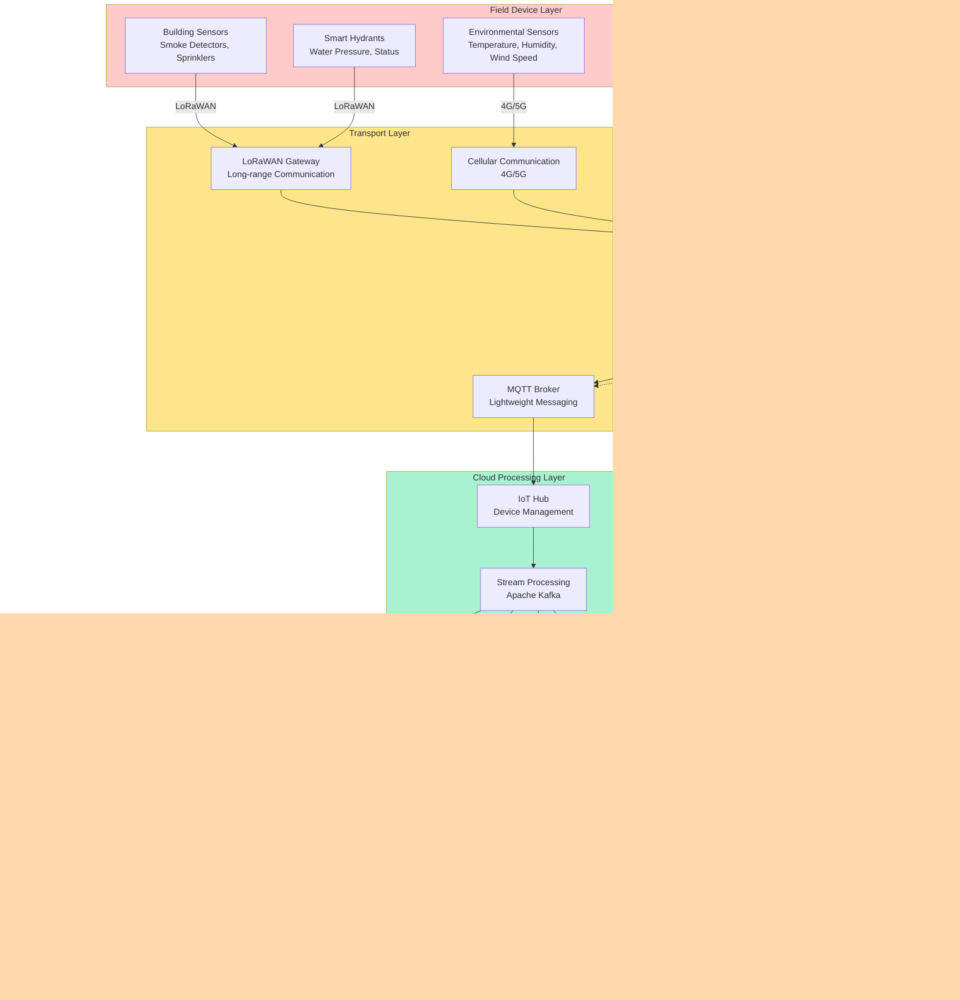

# Integrated Fire Management System (FMS) - Data Flow Diagrams

## Table of Contents
1. [Emergency Call to Dispatch - Complete Flow](#1-emergency-call-to-dispatch---complete-flow)
2. [On-Scene Operations Data Flow](#2-on-scene-operations-data-flow)
3. [Cross-System Data Integration Flow](#3-cross-system-data-integration-flow)
4. [Real-time Data Flow](#4-real-time-data-flow)
5. [Analytics & Reporting Data Flow](#5-analytics--reporting-data-flow)
6. [Inspection & Prevention Data Flow](#6-inspection--prevention-data-flow)
7. [IoT Sensor Data Flow](#7-iot-sensor-data-flow)
8. [Mobile App Data Synchronization Flow](#8-mobile-app-data-synchronization-flow)

---

## 1. Emergency Call to Dispatch - Complete Flow


---

## 2. On-Scene Operations Data Flow

```mermaid
sequenceDiagram
    participant Mobile as Personnel Mobile App
    participant FMS as FMS System
    participant CommandCenter as Command Center
    participant IoT as IoT Sensors
    participant Media as Media Storage
    participant DB as Database

    Note over Mobile,DB: Phase 1: On-Scene Arrival & Initial Assessment

    Mobile->>FMS: On-Scene Arrival Report<br/>{incident ID, arrival time, GPS}
    activate FMS
    
    FMS->>FMS: Update Incident Status<br/>Status: En Route → On Scene

    Mobile->>FMS: Initial Assessment Report<br/>{fire size, spread status, life hazard}
    
    FMS->>CommandCenter: Real-time Status Display
    activate CommandCenter

    Note over Mobile,DB: Phase 2: Additional Support Request (if needed)

    alt Additional Support Required
        Mobile->>FMS: Support Request<br/>{required vehicles, personnel, reason}
        FMS->>FMS: Search Available Support Units
        FMS->>CommandCenter: Display Support Recommendation
        CommandCenter->>FMS: Approve Support<br/>{additional vehicle IDs}
        FMS->>Mobile: Support ETA Notification
    end

    Note over Mobile,DB: Phase 3: Real-time Data During Operations

    loop Operations Active (1-minute intervals)
        Mobile->>FMS: Operation Status Update<br/>{personnel location, activity, progress}
        
        IoT->>FMS: Sensor Data<br/>{personnel vitals, ambient temp, gas levels}
        activate IoT
        
        FMS->>FMS: Safety Threshold Check
        
        alt Hazard Detected
            FMS->>Mobile: Emergency Alert<br/>{hazard type, evacuation directive}
            FMS->>CommandCenter: Emergency Notification
        end
        deactivate IoT
        
        FMS->>CommandCenter: Dashboard Update<br/>{map, timeline, metrics}
    end

    Note over Mobile,DB: Phase 4: On-Scene Media Recording

    Mobile->>Mobile: Photo & Video Capture<br/>(fire spread, damage assessment)
    Mobile->>Media: Media File Upload<br/>{images, metadata, GPS, timestamp}
    activate Media
    Media->>Media: File Compression & Optimization
    Media-->>FMS: Upload Complete Notification<br/>{file ID, URL}
    deactivate Media
    
    FMS->>DB: Save Media Reference<br/>{incident ID, file ID, type}
    activate DB

    Note over Mobile,DB: Phase 5: Fire Extinguished & Operations End

    Mobile->>FMS: Fire Extinguished Report<br/>{extinguish time, final status}
    FMS->>FMS: Calculate Operation Duration<br/>- Arrival to Extinguish: XX min<br/>- Total Operation Time: XX min

    Mobile->>FMS: Create Digital Report<br/>{fire cause, damage assessment, equipment used}
    FMS->>DB: Save Report Data
    
    FMS->>CommandCenter: Operations Complete Notification
    deactivate CommandCenter

    Note over Mobile,DB: Phase 6: Return to Station & Equipment Check

    Mobile->>FMS: Return to Station Report<br/>{return time}
    
    Mobile->>FMS: Equipment Check Checklist<br/>{equipment status, consumables refill, defects}
    FMS->>DB: Update Equipment Status

    Mobile->>FMS: Vehicle Fuel & Mileage Record<br/>{fuel consumption, mileage}
    FMS->>DB: Update Vehicle History

    Note over Mobile,DB: Phase 7: Incident Closure

    FMS->>FMS: Incident Completion Processing<br/>- All data validation<br/>- Timeline finalization<br/>- KPI calculation

    FMS->>DB: Save Final Data<br/>Status: On Scene → Completed
    deactivate DB
    
    deactivate FMS

    Note over Mobile,DB: All data persisted in PostgreSQL with audit trail
```



---

## 3. Cross-System Data Integration Flow


---

## 4. Real-time Data Flow


---

## 5. Analytics & Reporting Data Flow


### Analytics Data Flow Detailed Sequence


---

## 6. Inspection & Prevention Data Flow

```mermaid
sequenceDiagram
    participant Inspector as Inspector<br/>Mobile App
    participant FMS as FMS System
    participant Building as Building DB
    participant GIS as GIS System
    participant Violation as Violation Tracking System
    participant Notification as Notification Service
    participant Owner as Building Owner

    Note over Inspector,Owner: Phase 1: Inspection Planning & Scheduling

    FMS->>Building: Extract Risk-based Inspection Targets<br/>- Last inspection date<br/>- Building use<br/>- Violation history
    activate Building
    Building-->>FMS: Target Building List
    deactivate Building

    FMS->>GIS: Geographic Clustering<br/>Generate Efficient Route
    activate GIS
    GIS-->>FMS: Optimal Inspection Route
    deactivate GIS

    FMS->>Inspector: Distribute Inspection Schedule<br/>{date, building list, route}
    activate Inspector

    Note over Inspector,Owner: Phase 2: On-site Inspection

    Inspector->>FMS: Inspection Start Report<br/>{building ID, start time, GPS position}
    activate FMS

    FMS->>Inspector: Send Digital Checklist<br/>{items based on building type}
    
    loop Each Checklist Item
        Inspector->>Inspector: On-site Verification & Assessment<br/>- Fire suppression equipment<br/>- Evacuation routes<br/>- Fire compartmentation
        
        alt Defect/Violation Found
            Inspector->>Inspector: Take Photo<br/>with geolocation
            Inspector->>FMS: Report Violation<br/>{item, severity, photo, location}
            FMS->>Violation: Create Violation Record<br/>{building ID, violation content, deadline}
            activate Violation
        end
    end

    Inspector->>FMS: Inspection Complete Report<br/>{overall assessment, findings, next inspection date}
    
    Note over Inspector,Owner: Phase 3: Violation Correction Notice

    alt Violations Exist
        FMS->>Building: Get Building Owner Info
        Building-->>FMS: Owner Contact Information
        
        FMS->>Notification: Generate Correction Notice<br/>{violation content, correction deadline, penalties}
        activate Notification
        
        Notification->>Owner: Send Notification<br/>Email + Postal Mail
        activate Owner
        
        Notification->>Violation: Record Notification Sent
        deactivate Notification
    end

    Note over Inspector,Owner: Phase 4: Correction Verification & Follow-up

    Owner->>FMS: Correction Complete Report<br/>(Optional: via Web Portal)
    deactivate Owner
    
    FMS->>Inspector: Auto-generate Re-inspection Schedule<br/>{7 days before correction deadline}
    
    Inspector->>FMS: Conduct Re-inspection<br/>Verify correction status
    
    alt Correction Confirmed
        Inspector->>Violation: Close Violation<br/>{verification date, photo}
        Violation->>Building: Update Building Assessment<br/>Improve risk score
        deactivate Violation
    else Correction Incomplete
        Inspector->>Violation: Escalate Violation<br/>Flag for legal action
        FMS->>Notification: Send Warning Notice
    end

    FMS->>Building: Update Inspection History<br/>{inspection date, result, next scheduled date}
    deactivate Building

    Inspector->>FMS: Inspection Data Sync Complete
    deactivate Inspector
    deactivate FMS

    Note over Inspector,Owner: All data persisted in PostgreSQL with audit trail
```

---

## 7. IoT Sensor Data Flow



### IoT Data Processing Detailed Sequence

```mermaid
sequenceDiagram
    participant Device as IoT Device<br/>(Wearable)
    participant Gateway as IoT Gateway
    participant MQTT as MQTT Broker
    participant Stream as Stream Processing<br/>(Kafka)
    participant Rules as Rules Engine
    participant TSDB as Time-series DB<br/>(InfluxDB)
    participant Alert as Alert System
    participant Dashboard as Dashboard

    Note over Device,Dashboard: Real-time Data Streaming (1-second intervals)

    loop Continuous Monitoring
        Device->>Device: Sensor Reading<br/>{heart rate, temperature, SpO2, location}
        
        Device->>Gateway: Data Transmission (Bluetooth)<br/>JSON: {deviceId, timestamp, metrics}
        activate Gateway
        
        Gateway->>Gateway: Data Validation & Normalization<br/>- Range check<br/>- Missing value imputation
        
        Gateway->>MQTT: Publish<br/>Topic: sensors/wearable/{deviceId}
        activate MQTT
        deactivate Gateway
        
        MQTT->>Stream: Message Delivery
        activate Stream
        deactivate MQTT
        
        Stream->>Stream: Stream Processing<br/>- Window aggregation (5 sec)<br/>- Moving average calculation
        
        par Parallel Processing
            Stream->>TSDB: Save Time-series Data<br/>High-speed Write
            activate TSDB
            TSDB->>TSDB: Data Compression & Indexing
            deactivate TSDB
        and
            Stream->>Rules: Rule Evaluation
            activate Rules
            
            Rules->>Rules: Threshold Check<br/>Heart Rate > 180 bpm?<br/>Temperature > 39°C?<br/>SpO2 < 90%?
            
            alt Anomaly Detected
                Rules->>Alert: Generate Alert<br/>{level: CRITICAL, message, deviceId}
                activate Alert
                
                Alert->>Dashboard: 🚨 Emergency Notification Push<br/>WebSocket
                activate Dashboard
                Dashboard->>Dashboard: Warning Sound & Screen Flash
                deactivate Dashboard
                
                Alert->>Alert: Send SMS/Email<br/>→ Dispatcher
                deactivate Alert
                
                Rules->>TSDB: Record Alert Event
            end
            deactivate Rules
        and
            Stream->>Dashboard: Real-time Update<br/>WebSocket
            Dashboard->>Dashboard: Update Graphs & Meters
        end
        
        deactivate Stream
    end

    Note over Device,Dashboard: Data Retention Policy<br/>- Raw data: 7 days<br/>- Aggregated (1 min): 30 days<br/>- Aggregated (1 hour): 1 year
```



---

## 8. Mobile App Data Synchronization Flow


---

## Data Flow Summary

### Primary Data Paths

| Data Type | Origin | Processing Method | Storage | Real-time |
|----------|--------|---------|--------|--------------|
| **Emergency Call Data** | 112/911 Center | REST API → Dispatch Service | PostgreSQL | < 1 second |
| **GPS Location** | Fire Vehicles | WebSocket → Redis → DB | Redis + PostgreSQL | 5-second intervals |
| **Vital Signs** | Wearables | MQTT → Kafka → Time-series DB | InfluxDB | 1-second intervals |
| **Scene Photos & Videos** | Mobile App | Multipart → S3 | S3 + Metadata DB | Asynchronous |
| **Inspection Checklist** | Inspector App | Offline → Sync | SQLite → PostgreSQL | Batch Sync |
| **Analytics Reports** | Data Warehouse | ETL Batch | Data Warehouse | Daily Batch |

### Data Retention Policy

| Data Type | Retention Period | Archival Strategy |
|----------|---------|--------------|
| **Incident Records** | Permanent | Move to cold storage after 5 years |
| **GPS Location History (Raw)** | 90 days | Convert to 1-minute aggregates |
| **Vital Signs (Raw)** | 7 days | Convert to 5-minute aggregates |
| **Media Files** | Permanent | Compress & archive after 1 year |
| **Application Logs** | 30 days | Permanent storage for critical logs only |
| **Analytics Aggregates** | Permanent | Annual archival |

---

## Summary

This document provides detailed explanations of 8 major data flows in the FMS system:

1. **Emergency Call to Dispatch** - End-to-end dispatch process
2. **On-Scene Operations** - Real-time activity recording and safety monitoring
3. **Cross-System Integration** - Data exchange with external systems
4. **Real-time Data** - WebSocket-based bi-directional communication
5. **Analytics & Reporting** - ETL pipeline and BI
6. **Inspection & Prevention** - Digital inspection workflow
7. **IoT Sensors** - Edge-to-cloud IoT data processing
8. **Mobile Synchronization** - Offline support and conflict resolution

These data flows form the foundation for FMS to function as a **high-speed, highly reliable, and scalable** system.
